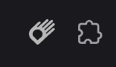
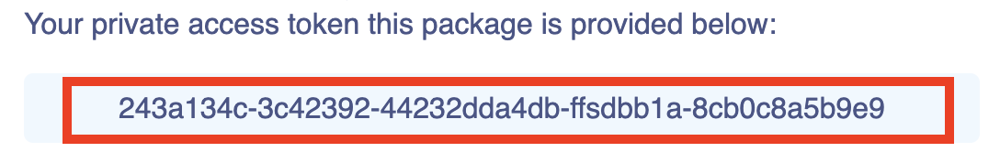

# Stage 1 - Map Interface Installation

### Step 0 - Download chrome extension

To check in the future whether the installation was successful, you first need to install the [MapGrab Inspector](https://chromewebstore.google.com/detail/mapgrab-inspector/bekghklmmijjkpanafimmhpilmbgngim) extension for the Google Chrome (or any Chromium-based) browser. To install the extension, go to the Chrome Web Store. Once the extension is installed, navigate to the page containing the map for which you want to install the interface. At this point, the installed extension's icon should be gray—don’t worry, this is normal for now. It will change soon!

This is what the extension icon should look like in your browser’s toolbar.



### Step 1 - Buy a license and get private access token

The next step is to install the library that embeds the communication interface for the map. This interface library is a paid npm package. To purchase a license, complete the purchase process at [PrivJS](https://privjs.com/packages/@mapgrab-priv/map-interface). After successfully completing the purchase, you will receive installation instructions along with a private access token via email.

Your private access token sent in the email should look like this:



### Step 2 - Setup .npmrc

Next, configure your npm client to authenticate and download the @mapgrab-priv/map-interface library. You can either use our ready-made script for this, or configure it manually.

import Tabs from "@theme/Tabs";
import TabItem from "@theme/TabItem";

<Tabs>
  <TabItem value="script" label="Script" default>
    :::info

    Replace the string **123456** in the code below with a private access token

    :::
    ```bash
      npx -y @mapgrab/npm-setup@latest 123456
    ```

  </TabItem>
  <TabItem value="manually" label="Manually">
    1. Create in project root directory .npmrc file if not exists
    2. Paste to the file (or append on the end) below code

    :::info

    Replace the string **123456** in the code below with a private access token

    :::

    ```
      @mapgrab-priv:registry=https://r.privjs.com
      //r.privjs.com/:_authToken=123456
    ```

  </TabItem>
</Tabs>

### Step 3 - Package installation

To install package run below command

<Tabs>
  <TabItem value="npm" label="npm" default>
    ```bash
    npm --save @mapgrab-priv/map-interface
    ```
  </TabItem>
  <TabItem value="yarn" label="yarn">
    ```bash
    yarn add @mapgrab-priv/map-interface
    ```
  </TabItem>
  <TabItem value="pnpm" label="pnpm">
    ```bash
    pnpm add @mapgrab-priv/map-interface
    ```
  </TabItem>
</Tabs>

### Step 4 - Interface installation
:::info

To optimize the size of your application for end users, we recommend using lazy loading for the interface.

:::
<Tabs>
  <TabItem value="lazy-loaded" label="Lazy Loaded (recommended)" default>
    ```ts 
      import { Map } from 'maplibre-gl';
      
      function initMap(): void {
        const map = new Map({
          container: 'map',
          style: 'https://demotiles.maplibre.org/style.json',
          center: [0, 0],
          zoom: 1,
          attributionControl: false,
          clickTolerance: 5,
        });

        // process.env.RUN_ONLY_IN_TEST_ENV is given as an example
        // diff-add
        if (process.env.RUN_ONLY_IN_TEST_ENV) {
          // diff-add
          import('@mapgrab-priv/map-interface').then(({ installMapGrab }) => {
            // diff-add
            installMapGrab(map, 'mainMap');
           // diff-add
          });
        // diff-add
        }
      }
    ```

  </TabItem>
  <TabItem value="standard" label="Standard">
    ```ts 
      import { Map } from 'maplibre-gl';
      // diff-add
      import { installMapGrab } from '@mapgrab-priv/map-interface';

      function initMap(): void {
        const map = new Map({
          container: 'map',
          style: 'https://demotiles.maplibre.org/style.json',
          center: [0, 0],
          zoom: 1,
          attributionControl: false,
          clickTolerance: 5,
        });

        // process.env.RUN_ONLY_IN_TEST_ENV is given as an example
        // diff-add
        if (process.env.RUN_ONLY_IN_TEST_ENV) {
          // diff-add
          installMapGrab(map, 'mainMap');
          // diff-add
        }
      }
    ```

  </TabItem>
</Tabs>

### Step 5 - Verify the MapGrab interface using the extension
Now, check if the MapGrab Inspector extension icon has changed color.
If it has, this means the interface has been installed correctly.
When you click on the extension icon, the map inspector should initialize.


