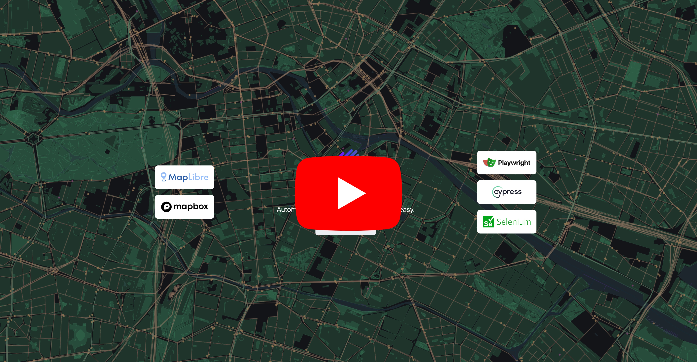

# Introduction

MapGrab is a tool that enables the writing of automated map tests based on the MapLibre GL JS and Mapbox GL JS libraries. Please review the following specifications.

---

## Supported testing frameworks

| Library                                             | Min version | Max version |
| --------------------------------------------------- | ----------- | ----------- |
| [Playwright (recommended)](https://playwright.dev/) | 1.20.0      | latest      |
| [Cypress](https://www.cypress.io/)                  | 13.0.0      | latest      |
| [Selenium/WebDriver](https://www.selenium.dev/)     | 4.0.3       | latest      |

## Supported map libraries

| Library                                                     | Min version | Max version |
| ----------------------------------------------------------- | ----------- | ----------- |
| [Mapbox GL JS](https://docs.mapbox.com/mapbox-gl-js/guides) | 2.0.0       | latest      |
| [Maplibre GL JS](https://maplibre.org/maplibre-gl-js/docs/) | 4.3.0       | latest      |

## Supported map layers type

| Layer type |
| ---------- |
| Symbol     |
| Line       |
| Fill       |
| Circle     |

## Supported features by testing frameworks

| Feature                                                                           | Playwright | Cypress | Selenium |
| --------------------------------------------------------------------------------- | ---------- | ------- | -------- |
| Trigger Click/dblclick/contextmenu on map elements                                | ✅         | ✅      | ✅       |
| Get bounding box element from map on screen (similar to getClientBoundingRect() ) | ✅         | ✅      | ✅       |
| Out of the box element visual regression (screenshot comparison)                  | ✅         | ❌      | ❌       |
| Wait to map loaded handler                                                        | ✅         | ✅      | ✅       |
| Wait to map complete painted/stable handler                                       | ✅         | ✅      | ✅       |
| Set map view (by window x/y or map lat/lng)                                       | ✅         | ✅      | ✅       |
| Fit map to bounds (by window x/y or map lat/lng)                                  | ✅         | ✅      | ✅       |
| Expose layers (eg. hide specific layers before make screenshot)                   | ✅         | ✅      | ✅       |
| Convert x/y screen point to lat/lng on map                                        | ✅         | ✅      | ✅       |
| Convert lng/lat to x/y position on screen                                         | ✅         | ✅      | ✅       |
| Working on iframe                                                                 | ✅         | ✅      | ✅       |
| Custom Assertions                                                                 | ✅         | ✅      | ❌       |
